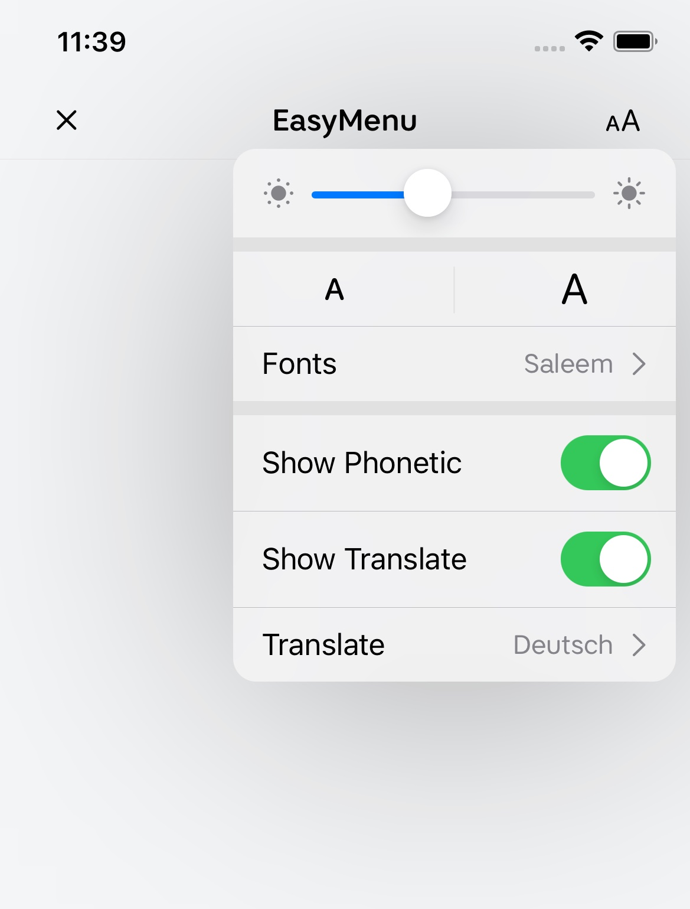

# EasyMenu

SwiftUI Menu but not only button (similar to the native [Menu](https://developer.apple.com/documentation/SwiftUI/Menu))

You can create custom Menu.
#### Important
This version is not compatible with NavigationView.toolbar
## Installation

To use EasyMeny with a project targeting iOS 13, simply copy folder Source into your project.

#### Swift Package Manager
To integrate EasyMenu into your project using SwiftPM add the following to your Package.swift:


```bash
 dependencies: [
    .package(url: "https://github.com/hdehghan/EasyMenu", from: "0.1.0"),
],
```
## Usage

To deploy this project run

```swift
EasyMenu {
    Group {
        HStack {
            Image(systemName: "sun.min.fill")
                .foregroundColor(Color(.secondaryLabel))
            Slider(value: .constant(0.5))
            Image(systemName: "sun.max.fill")
                .foregroundColor(Color(.secondaryLabel))
        }
        .padding(.horizontal)
            .frame(height: 50)
    }
                
    Divider()
                    
    Toggle("Show Translate", isOn: .constant(true))
        .padding(.horizontal)
            .frame(height: 54.0)
} label: {
    Image(systemName: "textformat.size")
}
```
## Demo

<p align="center">

</p>


## Requirements
| EasyMenu          | Swift           | Xcode           | Platforms |
|---------------|-----------------|-----------------|----------------|
| EasyMenu 0.1    | Swift 5.0       | Xcode 12.0      | iOS 13.0  |


## Roadmap
- [x] Support DarkMode
- [ ] Support macOS
- [ ] Support NavigationView.toolbar


## Communication
- If you found a bug, open an issue or submit a fix via a pull request.
- If you have a feature request, open an issue or submit a implementation via a pull request or hit me up on **hd.dehghan@gmail.com** or **[telegram](https://t.me/hsndq)**..
- If you want to contribute, submit a pull request onto the master branch.
- Contributions are always welcome!

